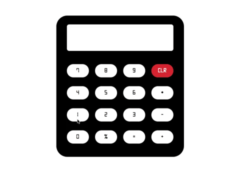

# JavaScript-Projects
Simple projects made using HTML, CSS &amp; JavaScript

## Calculator
A fully working simplistic calculator. I decided to go for a classic design approach with the font and colour schemes.

*hint: enter 543974 (skepta) for a hidden feature!!*

>"a picture is worth a thousand words, a video is worth a million"

